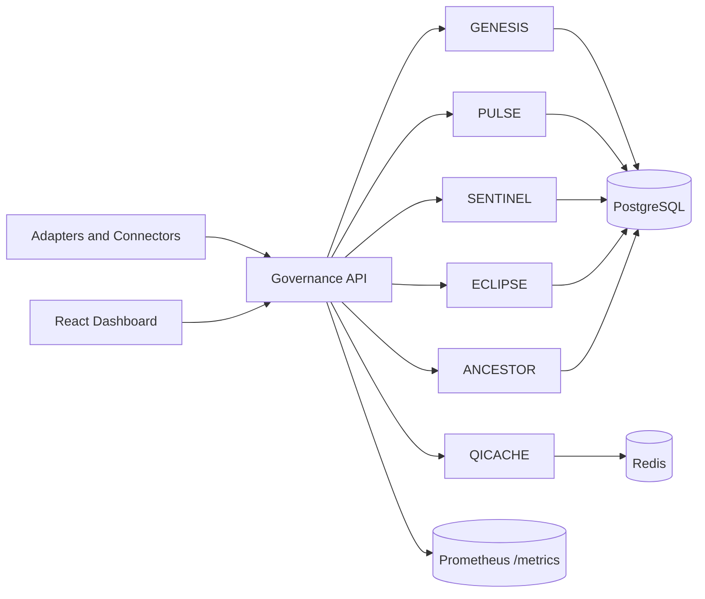

<p align="center">
  
  
  
  
  
  
</p>

# AgentGovern OS

> **The Operating System for Governing Autonomous AI Agents**
>
> One platform. Any agent. Any framework. Total control.

AgentGovern OS is an enterprise-grade governance platform that provides **identity, policy enforcement, trust scoring, audit logging, and human-in-the-loop approvals** for autonomous AI agents — regardless of the framework they are built on.

It doesn't replace your agents. **It governs them.**

---

## Why AgentGovern OS?

AI agents are being deployed across enterprises at scale — purchasing, approving invoices, modifying salaries, accessing PII. But there is **no operating system** to govern what they can do, how much authority they have, or who is responsible when they fail.

AgentGovern OS fills that gap by treating every AI agent as a **Digital Colleague** with:
- **Identity & DNA** — Every agent is registered with a unique code, tier, and authority limits
- **Runtime Policy Enforcement** — Actions are evaluated against 7+ policy rules *before* execution
- **Dynamic Trust Scores** — Trust expands or contracts based on proven performance
- **Immutable Audit Trail** — Every decision is permanently recorded
- **Human-in-the-Loop** — High-risk actions are escalated for human approval

---

## Supported Agent Frameworks

| Framework | Connector Type | Integration |
|-----------|---------------|-------------|
| **CrewAI** | `GovernedCrew` | Drop-in wrapper for Crew + Agents |
| **LangChain** | `GovernedAgentExecutor` | Replaces `AgentExecutor` |
| **OpenAI Agents SDK** | `GovernedRunner` | Wraps the SDK Runner |
| **Anthropic** | `GovernedAnthropicClient` | Drop-in for `anthropic.Anthropic` |
| **AutoGen** | `GovernedAssistantAgent` | Wraps AutoGen agents |
| **Any Framework** | `@governed_action` | Universal Python decorator |
| **HTTP/Webhook** | `WebhookMiddleware` | For non-Python systems |

---

## Quick Start

### Prerequisites
- Python 3.11+
- Docker & Docker Compose
- Node.js 18+ (for the dashboard)

### 1. Clone & Configure
```bash
git clone https://github.com/your-org/agentgovern-os.git
cd agentgovern-os
cp .env.example .env
```

### 2. Start the Platform
```bash
docker compose up -d
```

This starts: **Governance API** (port 8000), **PostgreSQL** (35432), **Redis** (36379), **ChromaDB** (8001), **Prometheus** (9090), **Grafana** (3000).

### 3. Seed Demo Data
```bash
python scripts/seed_demo.py
```

### 4. Start the Dashboard
```bash
cd frontend
npm install
npm run dev
```
Open `http://localhost:5173` for the dashboard.

### 5. Install the CLI
```bash
cd cli
pip install -e .
agentgovern scan .
```

---

## Architecture

```
┌──────────────────────────────────────────────────────────┐
│                    AgentGovern OS                         │
├──────────────┬──────────────┬──────────────┬─────────────┤
│   CLI        │  SDK         │  Connectors  │  Dashboard  │
│  (Scanner)   │  (GovCore)   │  (6 + Any)   │  (React)    │
├──────────────┴──────────────┴──────────────┴─────────────┤
│              Governance API (FastAPI)                     │
│  ┌─────────┬────────┬──────────┬────────┬──────────────┐ │
│  │ GENESIS │ PULSE  │ SENTINEL │ ECLIPSE│ ANCESTOR     │ │
│  │ Registry│ Trust  │ Policy   │ HITL   │ Audit Ledger │ │
│  └─────────┴────────┴──────────┴────────┴──────────────┘ │
├──────────────────────────────────────────────────────────┤
│  PostgreSQL  │  Redis  │  ChromaDB  │  Prometheus        │
└──────────────────────────────────────────────────────────┘
```



## Quick Links

- Quickstart: `docs/QUICKSTART.md`
- API reference: `docs/API_REFERENCE.md`
- Connector guide: `docs/CONNECTORS.md`
- Demo runbook: `docs/DEMO_SCENARIO.md`

---

## Project Structure

```
agentgovern-os/
├── cli/                    # AgentGovern CLI (pip-installable scanner)
│   ├── agentgovern/        # Scanner, policy engine, ABOM generator
│   └── tests/              # CLI unit tests
├── connectors/             # SDK connectors for 6+ frameworks
│   ├── crewai/             # CrewAI governance wrapper
│   ├── langchain/          # LangChain governance wrapper
│   ├── openai/             # OpenAI Agents SDK wrapper
│   ├── anthropic/          # Anthropic client wrapper
│   ├── autogen/            # Microsoft AutoGen wrapper
│   ├── generic/            # Universal decorator + webhook middleware
│   └── sdk/                # Core GovCore + GovernanceEnvelope
├── services/
│   ├── governance-api/     # FastAPI backend (GENESIS, PULSE, SENTINEL, etc.)
│   └── crewai-engine/      # 9-agent CrewAI orchestration engine
├── frontend/               # React + Vite dashboard
├── data/migrations/        # PostgreSQL schema
├── infra/                  # Prometheus, Grafana config
├── scripts/                # Seed data and utilities
├── docker-compose.yml      # Full development stack
└── pyproject.toml          # Python project config
```

---

## Core Modules

| Module | Purpose |
|--------|---------|
| **GENESIS** | Agent Identity Registry — register, update, list agents |
| **PULSE** | Dynamic Trust Scoring — expand/contract autonomy |
| **SENTINEL** | Policy Enforcement — 7+ rules evaluated pre-execution |
| **ANCESTOR** | Immutable Audit Ledger — every decision recorded |
| **ECLIPSE** | Human-in-the-Loop — escalation queue + admin workbench |
| **QICACHE** | Response Cache — 68% LLM cost reduction |
| **CONTRACT** | Social Contracts — formal employment agreements for agents |

---

## API Reference

| Method | Endpoint | Description |
|--------|----------|-------------|
| `POST` | `/governance/evaluate` | **Universal evaluation** — all connectors call this |
| `GET` | `/api/v1/agents/` | List registered agents |
| `POST` | `/api/v1/agents/register` | Register a new agent |
| `GET` | `/api/v1/trust/leaderboard` | Trust score leaderboard |
| `GET` | `/api/v1/audit/` | Audit log entries |
| `GET` | `/api/v1/escalations` | Pending HITL escalations |
| `POST` | `/api/v1/escalations/{id}/resolve` | Approve/Reject an escalation |
| `GET` | `/api/v1/policies/` | Active governance policies |

Full interactive docs at `http://localhost:8000/docs`.

---

## Tech Stack

| Layer | Technology |
|-------|-----------|
| **Backend API** | Python 3.11+, FastAPI, SQLAlchemy (async), Pydantic v2 |
| **Database** | PostgreSQL 16 + TimescaleDB |
| **Cache** | Redis 7 |
| **Vector Memory** | ChromaDB |
| **Frontend** | React 18, Vite, TanStack Query, Framer Motion, MUI Icons |
| **CLI** | Typer, Rich |
| **LLM Providers** | Ollama (local), OpenAI, Anthropic |
| **Agent Frameworks** | CrewAI, LangChain, OpenAI Agents SDK, Anthropic, AutoGen |
| **Monitoring** | Prometheus, Grafana |
| **Container** | Docker Compose |

---

## License

MIT License. See [LICENSE](LICENSE) for details.
